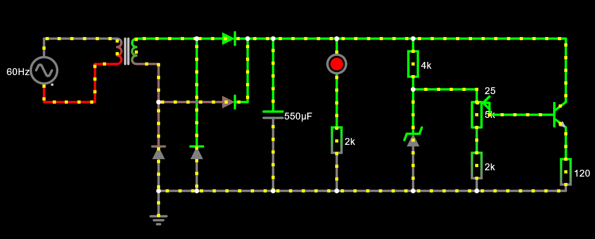
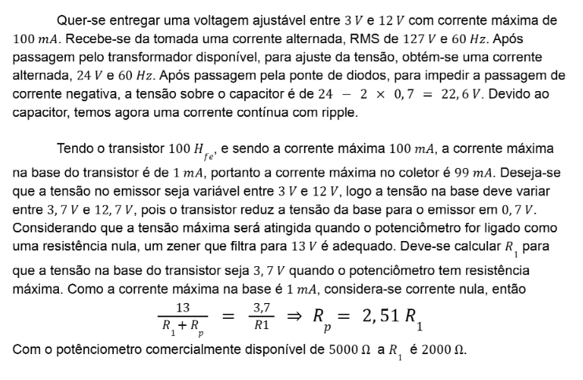
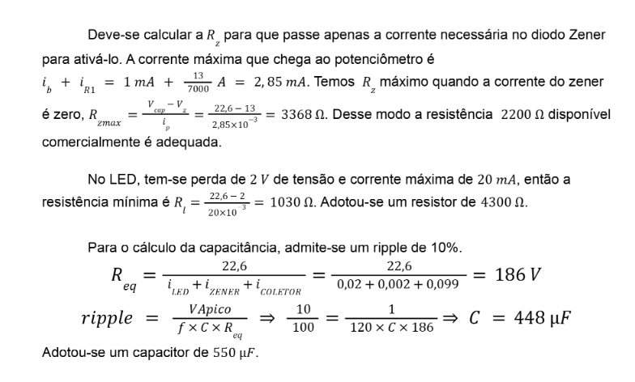
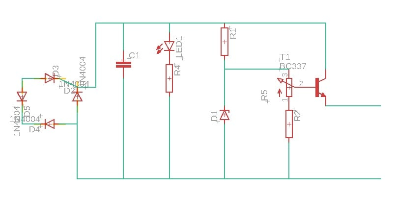
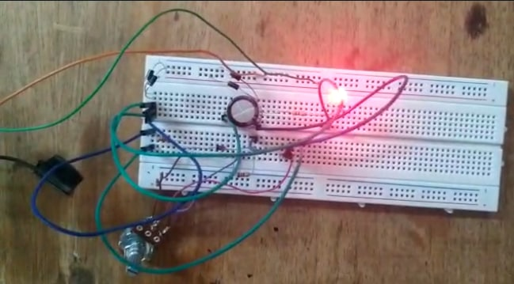

# Fonte de Tensão Ajustável

## Instruções:

Construção de uma fonte reficadora capaz de transformar corrente alternada de tensão eficaz de 127 volts (pico de 179,6 volts) em uma corrente contínua, com valor de tensão ajustável entre 3 e 12 volts. 

Teremos a partir da tomada: tensão 127 volts, corrente alternada e frequência de 60 hz.

## Escolha dos componentes:
| Quantidade | Componentes              | Valor R$                |
|------------|--------------------------|-------------------------|
| 4          | DIODO  1N4007          | [R$ 0,20  x  4 = R$0,80]|
| 1          | CAPACITOR 680UF X 50V  | [R$ 5,00]|
| 1          | Led Vermelho 5mm       | [R$ 0,50]|
| 2          | Resistor 2.2k ohm      | [R$ 0,07  x  2 = R$0,14]|
| 1          | Resistor 4.3k ohm      | [R$ 0,07]|
| 1          | Potenciômetro  5k ohm  | [R$ 7,00]|
| 1          | Diodo Zener 13V        | [R$ 0,50]|
| 1          | Transistor NPN         | [R$ 0,45]|
| **Total**  |                        |  R$ 14,46|

## Os componentes

* **Transformador**: Reduz a tensão de 110V advinda da tomada para 24V.

* **Ponte de diodo**: faz com que a corrente alternada advinda do transformador passe a ser contínua.

* **Capacitor**: armazena e descarrega carga durante as diferentes fases do ciclo de corrente alternada, mantendo a corrente do circuito constante.

* **Diodo Zener**: regula a tensão do circuito para que se mantenha sempre por volta de 13V (tensão nominal do diodo).

* **Resistores**: reduzem tensão e impedem que outros componentes fiquem sob potências maiores que seus limites e acabem por queimar.

* **Potenciometro**: componente de resistência variável que permite a variação entre 3V e 12V nas saídas da fonte.

* **Transistor**: utilizado para amplificar a corrente que passa para as saídas da fonte.

## Imagem do circuito 

## Cálculo do capacitor 

## Link do circuito no Falstad: 
https://tinyurl.com/2clwz5w6

## Imagem esquemático da PCB 

## Imagem da fonte na ProtoBoard 

## Vídeo no Youtube TROCAR
https://youtu.be/0L9eRKaqJ-0

## Alunos:
João Pedro Soares Azevedo Calixto [(Calixto)]

Eduarda Neumasn Firstuadmanm [(Duda)]

Lucas de Souza Brandão [(Bombril)]
