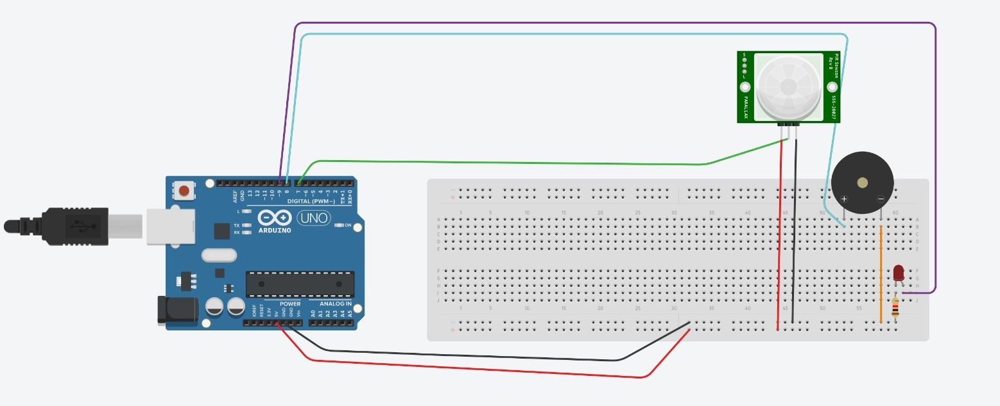
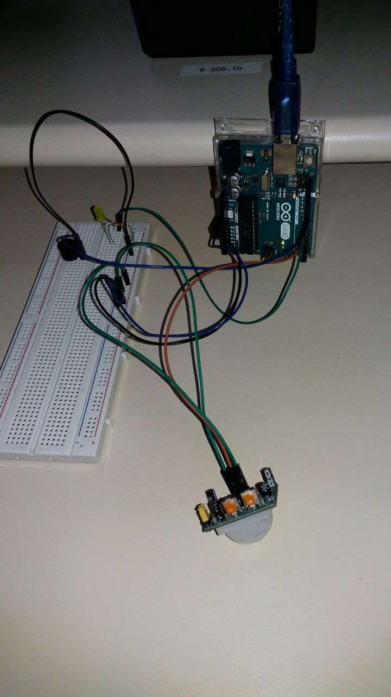

# Alarme 

## Instruções:

Construção de um alarme, que apita ao detectar movimento e pode ser posicionado perto de portas a fins de segurança.

## Os componentes

Sensor de Movimento, Buzzer, LED, resistor, jumpers e arduino.

## Imagem das conexões do circuito

## Imagem do circuito montado 

## Vídeo no Youtube 
https://youtube.com/shorts/yVa9U3Thy9Y?feature=share

## Alunos:
João Pedro Soares Azevedo Calixto [(Calixto)]

Eduarda Fritzen Neumann [(Duda)]

Lucas de Souza Brandão [(Bombril)]
